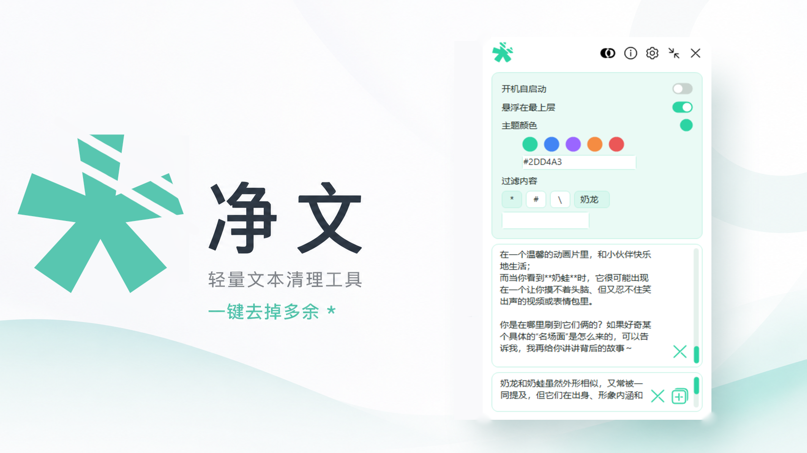

# 净文 CleanText

一个轻量、离线的 Windows 文本清理工具。



## 使用

下载并直接运行 `CleanText.exe`，无需安装、登录或联网。

1. 在输入框粘贴或输入文本。
2. 按 Enter 生成清理结果。
3. 点击复制按钮，将结果复制到剪贴板。

## 功能

- 按选中的过滤内容清理文本，默认过滤 `*`
- 支持 `#`、`\` 与自定义过滤内容
- 一键复制、删除结果与清空输入
- 自定义主题色与深色模式
- 窗口置顶、开机启动与可拖动收纳球
- 本地处理文本，不上传内容

## 构建源码

需要 Windows 10/11 x64 与 Visual Studio 2022（或 Build Tools 2022）的“使用 C++ 的桌面开发”工作负载：

```bat
CleanTextNative\build.bat
```

构建完成后的发布文件为根目录 `CleanText.exe`。可执行以下命令进行行为自检：

```bat
CleanText.exe --selftest
```

## 说明

净文是免费软件。如果你通过付费方式获得它，说明你可能受骗了。

作者：nakili<br>

## 许可证

本项目采用 MIT License 开源。
