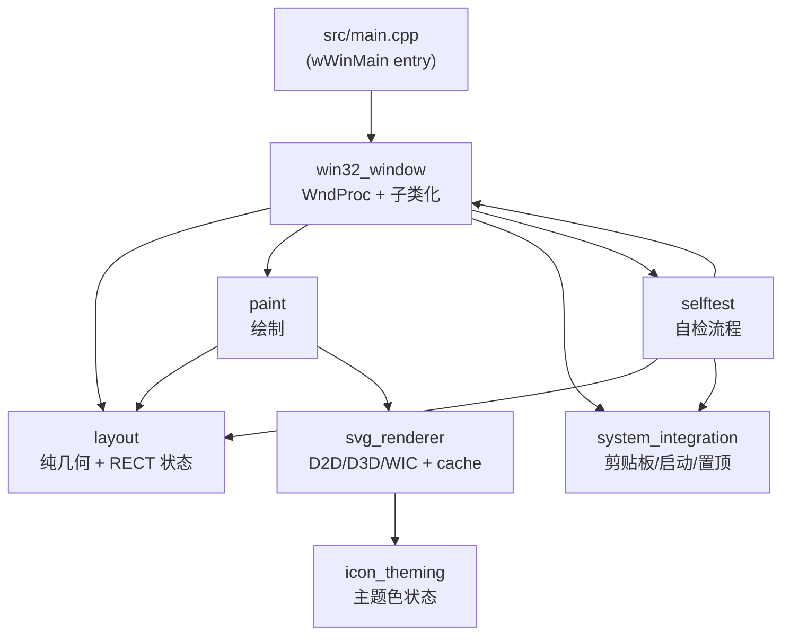

# CleanText Native 模块化拆分设计

> 项目：`F:\StarAway\CleanTextNative\`
> 当前文件：`main.cpp`（977 行单文件）
> 设计日期：2026-09-02
> 状态：**基线文档**（拆分尚未开始）

---

## 1. 拆分动机

### 1.1 现状

`CleanTextNative/main.cpp` 是一个 977 行的 C++ 源文件，将所有逻辑塞进单个匿名 namespace：

| 职责                                                                       | 大致行数 |
| -------------------------------------------------------------------------- | -------- |
| 入口 (`wWinMain`、Gdiplus 启动）                                           | ~50      |
| 全局状态声明（HWND、CACHE、COLORREF、bool flag）                           | ~60      |
| SVG 资源加载与主题色替换（`ThemeSvg`）                                     | ~70      |
| SVG/D2D/D3D/WIC 渲染器（`InitSvgRenderer`、`DrawSvg`）                     | ~50      |
| 几何辅助（`R/In/IconBox/ScrollTrack/ScrollThumb/VisibleLines`）            | ~50      |
| 绘制原语（`FillRound/Text/Toggle/DrawAsset/DrawLogo/DrawSvg*`）            | ~40      |
| 布局计算（`HeightFor/Layout`）                                             | ~50      |
| 命中检测（`ButtonAt`）                                                     | ~30      |
| 滚动条（`PaintScroll/ScrollTo/HasScroll`）                                 | ~30      |
| 系统集成（剪贴板/启动子/置顶）（`CopyResult/SetStartup/IsStartupEnabled`） | ~50      |
| 窗口消息循环（`WndProc`）                                                  | ~200     |
| 编辑器子类化（`EditProc`）                                                 | ~10      |
| Overlay 子类化（`ActionProc`）                                             | ~25      |
| 自检（`SelfTest`）                                                         | ~20      |
| 资源声明 + `resource.h` 引用 + 各种 `R( ... )`                             | 散落     |

### 1.2 问题

1. **任何"按钮"修改都需要改 8 处**：全局状态、布局、绘制、命中、ActionProc、WM_CREATE、WM_COMMAND、WM_DRAWITEM。漏一处就出 bug。
2. **修复删除按钮时我已经失败过两次**：一次被 `g_output` 白底遮住右半，一次 z-order 顶层没生效。一次缩小 22×22 也没解决问题。
3. **调试时无法局部聚焦**：任何修改都得通读 977 行。

### 1.3 目标

- 单个"按钮"修改只触及 **1-2 个文件**
- 每个文件 < 300 行
- 零行为变化优先；每个阶段以 `CleanText.exe --selftest` 输出**逐字节相同**为金标准

---

## 2. 模块架构

### 2.1 依赖图



依赖方向严格自底向上。**低层不引用高层**。

### 2.2 模块列表

| #   | 模块                 | 命名空间     | 职责                                                            | 依赖                                                      |
| --- | -------------------- | ------------ | --------------------------------------------------------------- | --------------------------------------------------------- |
| 1   | `layout`             | `ui::layout` | 所有 RECT 全局变量 + `compute()`                                | windows.h                                                 |
| 2   | `svg_renderer`       | `svg`        | D3D/D2D/WIC 初始化、ThemeSvg、DrawSvg、Gdiplus 资源加载 + cache | windows.h, nanosvg, icon_theming                          |
| 3   | `icon_theming`       | `theming`    | `current` 主题色 + 5 预设 + 自定义 hex 解析 + 应用              | windows.h                                                 |
| 4   | `paint`              | `ui::paint`  | FillRound/Text/Toggle/DrawSvg\* 包装 + Paint 顶层函数           | layout, svg_renderer                                      |
| 5   | `system_integration` | `sys`        | CopyResult、IsStartupEnabled、SetStartup、setTopmost            | windows.h                                                 |
| 6   | `win32_window`       | `win`        | createMainWindow、runMessageLoop、WndProc、EditProc、ActionProc | layout, paint, system_integration, icon_theming, selftest |
| 7   | `selftest`           | `test`       | runSelfTest（写 txt、退出）                                     | layout, system_integration, win                           |
| 8   | `main.cpp`           | (顶层)       | wWinMain 入口、Co/Gdiplus 初始化、注册窗口类、消息循环、清理    | win                                                       |

### 2.3 文件布局

```
CleanTextNative/
├── CleanTextNative.vcxproj        # 更新：加入 src/ 下所有 .cpp
├── CleanTextNative.rc             # 不变
├── icon.ico                       # 不变
├── app.manifest                   # 不变
├── nanosvg.h                      # 不变
├── nanosvgrast.h                  # 不变
├── resource.h                     # 不变
├── build.bat                      # 不变（对 vcxproj 内容透明）
├── README.md                      # 微调：增加模块结构图
└── src/
    ├── main.cpp                   # 仅 wWinMain 入口
    ├── layout.hpp / layout.cpp
    ├── svg_renderer.hpp / svg_renderer.cpp
    ├── icon_theming.hpp / icon_theming.cpp
    ├── paint.hpp / paint.cpp
    ├── system_integration.hpp / system_integration.cpp
    ├── win32_window.hpp / win32_window.cpp
    └── selftest.hpp / selftest.cpp
```

---

## 3. 模块接口

### 3.1 `layout.hpp`

```cpp
// ui::layout 命名空间
namespace ui::layout {

// 常量（从当前 main.cpp 的 constexpr 迁出）
constexpr int WINDOW_WIDTH = 400;
constexpr int OUTER_MARGIN = 14;
constexpr int HEADER_HEIGHT = 57;
constexpr int INPUT_MIN_HEIGHT = 50;
constexpr int INPUT_MAX_HEIGHT = 200;
constexpr int OUTPUT_MIN_HEIGHT = 64;
constexpr int OUTPUT_MAX_HEIGHT = 200;

// 所有按钮/区域的全局 RECT 状态
extern RECT input;
extern RECT output;
extern RECT settings;
extern RECT btnSettings;
extern RECT btnMinimize;
extern RECT btnClose;
extern RECT btnClearInput;
extern RECT btnCopyOutput;
extern RECT btnDeleteOutput;          // ★ 新增按钮在 layout 模块加一行
extern RECT chkStartup;
extern RECT chkTopmost;
extern RECT btnColorCircle;
extern RECT btnApplyColor;

extern std::vector<RECT> presetColorCircles;

// 由 main_window 拥有，layout 仅访问其位置
extern HWND hwndInput;
extern HWND hwndOutput;
extern HWND hwndColorInput;

// 计算所有 rect（每次窗口大小变化、设置面板展开、按钮状态变化时调用）
// 内部根据 g_result 是否为空、g_settings 是否展开等做条件分支
void compute(bool force = false);

}  // namespace ui::layout
```

**新增按钮的代价**：在 `layout.cpp` 加一个 `RECT g_btnXxx;` + 在 `compute()` 里算——**一处改动**。

### 3.2 `svg_renderer.hpp`

```cpp
namespace svg {

// 初始化 D3D/D2D/WIC；只在启动时调一次
bool init();

// 清理（程序退出时调）
void shutdown();

// 加载所有 SVG/PNG 资源到内存（Gdiplus::Image + IStream）
// 对应当前 main.cpp 里 loadAsset lambda
void loadResources(HINSTANCE);

// 释放资源
void releaseResources();

// 主题色注入：从 RCDATA 资源读 SVG XML，替换 fill 颜色，返回新 XML
// 对应 ThemeSvg
std::string themeSvg(int resourceId, COLORREF color);

// 绘制 SVG（带 cache，对应 DrawSvg）
void draw(HDC hdc, int resourceId, RECT rect, bool useThemeColor);

// 取得已加载的 Gdiplus::Image 指针（给 Paint 用，渲染光栅位图）
Gdiplus::Image* getGdiplusImage(int resourceId);

}  // namespace svg
```

### 3.3 `icon_theming.hpp`

```cpp
namespace theming {

extern COLORREF current;        // 当前主题色（默认 GREEN = RGB(45,212,163)）

constexpr COLORREF DEFAULT_COLOR = RGB(45, 212, 163);
constexpr COLORREF PRESET_COLORS[] = {
    RGB(45, 212, 163), RGB(66, 133, 244), RGB(154, 102, 255),
    RGB(245, 140, 66), RGB(235, 87, 87)
};

// 应用主题色：内部直接修改 theming::current
void applyPreset(int index);
bool applyHex(const std::wstring& hex);  // 返回是否成功解析
bool parseColor(const std::wstring& text, COLORREF& out);

}  // namespace theming
```

### 3.4 `paint.hpp`

```cpp
namespace ui::paint {

// 顶层 Paint()：按顺序画背景、标题、设置面板、输入框、输出框
void paint(HDC hdc);

// 分区域绘制（便于将来插入/删除元素）
void renderBackground(HDC);
void renderHeader(HDC);        // 标题栏 + logo + 三个标题按钮
void renderSettingsPanel(HDC); // 设置面板
void renderInputBox(HDC);      // 输入框 + 清空按钮 + 滚动条
void renderOutputBox(HDC);     // 输出框 + 复制按钮 + ★ 删除按钮 + 滚动条 + "已复制"提示

// 绘制原语
void fillRound(HDC, RECT, COLORREF, int radius, COLORREF stroke = CLR_INVALID);
void drawText(HDC, const wchar_t*, RECT, UINT flags, COLORREF, HFONT);
void drawScrollBar(HDC, HWND edit, RECT cardRect);
void drawToggleSwitch(HDC, RECT, bool on);

}  // namespace ui::paint
```

**新增按钮的代价**：`renderOutputBox` 加一段绘制代码（调 `fillRound + svg::draw(IDR_CANCEL_SVG, ...)`），**单一改动**。

### 3.5 `system_integration.hpp`

```cpp
namespace sys {

// 剪贴板（带重试，对应 CopyResult）
void copyToClipboard(HWND owner, std::wstring_view text);

// 开机自启动
bool isStartupEnabled();
void setStartup(bool enabled);

// 窗口置顶
void setTopmost(HWND hwnd, bool topmost);

}  // namespace sys
```

### 3.6 `win32_window.hpp`

```cpp
namespace win {

// 拥有所有 UI 状态（g_hot/g_pressed/g_copied/g_settings/...）
// 拥有所有 overlay HWND（g_clearOverlay/g_copyOverlay/g_deleteResultOverlay）
extern HWND mainWindow;
extern HWND hwndClearOverlay;
extern HWND hwndCopyOverlay;
extern HWND hwndDeleteResultOverlay;
extern HFONT uiFont;
extern HFONT titleFont;

// 当前 UI 状态
extern int  g_hot;             // 当前 hover 的按钮 id（0=无）
extern int  g_pressed;
extern bool g_settingsOpen;
extern bool g_topmost;
extern bool g_startup;
extern bool g_colorPickerOpen;
extern bool g_copied;
extern std::wstring g_result;
extern int  g_inputHeight;

// 创建主窗口（含所有子控件和 overlay）+ 注册 WndProc
HWND createMainWindow(HINSTANCE);

// 消息循环 + quit
int runMessageLoop();
void quit();

// 子类化回调（导出供 SetWindowSubclass）
LRESULT CALLBACK editProc(HWND, UINT, WPARAM, LPARAM, UINT_PTR, DWORD_PTR);
LRESULT CALLBACK actionProc(HWND, UINT, WPARAM, LPARAM, UINT_PTR, DWORD_PTR);

// 主窗口过程
LRESULT CALLBACK wndProc(HWND, UINT, WPARAM, LPARAM);

// 内部工具
int  buttonAtPoint(POINT p);  // 对应 ButtonAt
void processInput();           // 按 Enter 处理输入
void clearInputText();         // 清空输入
void deleteResult();           // ★ 清空输出（拆分后的"删除按钮"调用点）

// 调试日志
void logUnhandledException(const std::wstring& where, DWORD errorCode);

}  // namespace win
```

### 3.7 `selftest.hpp`

```cpp
namespace test {

// 跑 --selftest 流程：模拟 4 次输入/清空/复制，把结果写到 txt，退出
void run();

}  // namespace test
```

### 3.8 `main.cpp`（入口）

只保留：

```cpp
int APIENTRY wWinMain(HINSTANCE instance, HINSTANCE, LPWSTR cmd, int) {
    CoInitializeEx(nullptr, COINIT_APARTMENTTHREADED);
    // Gdiplus 启动
    // svg::init() / svg::loadResources()
    // 注册窗口类
    HWND hwnd = win::createMainWindow(instance);
    // 启动时检测 --selftest
    if (wcsstr(cmd, L"--selftest")) test::run();
    // 消息循环
    int rc = win::runMessageLoop();
    // 清理
    svg::shutdown();
    return rc;
}
```

---

## 4. 全局状态归属

| 当前 main.cpp 变量                                                                                       | 归属模块                                                         |
| -------------------------------------------------------------------------------------------------------- | ---------------------------------------------------------------- |
| `g_hwnd`                                                                                                 | `win::mainWindow`                                                |
| `g_input, g_output, g_colorInput`                                                                        | `ui::layout::hwndInput/output/colorInput`（位置）+ `win`（拥有） |
| `g_clearOverlay, g_copyOverlay, g_deleteResultOverlay`                                                   | `win::hwndClearOverlay/CopyOverlay/DeleteResultOverlay`          |
| `g_font, g_titleFont`                                                                                    | `win::uiFont/titleFont`                                          |
| `g_logo, g_logoStream` 等 Gdiplus 资源                                                                   | `svg::g_*Image`（私有）                                          |
| `g_svgLogo, g_svgCancel, g_svgCopy, g_svgSettings` cache                                                 | `svg::g_cache*`（私有）                                          |
| `g_d3d, g_d2dFactory, g_d2dDevice, g_d2d, g_wic, g_d3dContext`                                           | `svg`（私有）                                                    |
| `g_dragScroll`                                                                                           | `win`                                                            |
| 所有 RECT 变量（`g_inputRect/outputRect/...`）                                                           | `ui::layout::*`                                                  |
| `g_settings, g_topmost, g_startup, g_colorPicker`                                                        | `win::*`                                                         |
| `g_theme`                                                                                                | `theming::current`                                               |
| `g_hot, g_pressed, g_copied`                                                                             | `win::*`                                                         |
| `g_presetColors, g_colorInput, g_colorButton, g_applyColor`                                              | `ui::layout`（几何）+ `win`（HWND）                              |
| `g_result`                                                                                               | `win::g_result`                                                  |
| `g_inputHeight`                                                                                          | `win::g_inputHeight`                                             |
| 常量 `W, M, HEADER, INPUT_MIN, INPUT_MAX, OUTPUT_MIN, OUTPUT_MAX, GREEN, DARK_GREEN, BORDER, SOFT, TEXT` | 拆到 `ui::layout`（几何）+ `theming`（颜色）                     |

---

## 5. 删除按钮的最终修复

模块化完成后，"31×31 不缩小、且不被遮挡"的修复路径：

**问题根因（已确认）**：当前 `g_deleteResultButton = R(right-86, ..., right-55, ...)` 跨越 `g_output` 右边沿 `right-68`，左半 18 像素在 `g_output`（readonly EDIT）白底区域内被遮。

**修复方案**（在 `layout.cpp::compute()` 改一行）：

```cpp
// 复制按钮（保持）：btnCopyOutput = R(right-51, bottom-41, right-20, bottom-10);  // 31×31
// 删除按钮（修复）：垂直堆叠在复制按钮上方
btnDeleteOutput = R(right-51, bottom-77, right-20, bottom-46);  // 31×31
```

**验证**：

- `right-51 > right-68` ✅ 完全在 `g_output` 之外
- y 范围 `bottom-77` 到 `bottom-46`——底部内边距 12 px（与 `OUTPUT_MIN=64` 兼容：`bottom - 77 = top - 13`，但因为 `outputRect.top` 是动态的，实际 y = `outputRect.top + (outputH) - 77`，需要 `outputH >= 77-12 = 65`——OUTPUT_MIN=64 时差1 像素）
- 解决：`OUTPUT_MIN` 改 80 或删除按钮 y 调整为 `bottom-76, bottom-46`（少5 像素）——后者更安全

**改后涉及的文件**：

- `layout.cpp` 1 行（btnDeleteOutput 坐标）
- `paint.cpp::renderOutputBox` 加一行（绘制删除按钮）
- `win32_window.cpp::buttonAtPoint` 加一个分支（命中检测 id=8）

**vs 当前混乱的 8 处**：从 8 处降到 3 处。

---

## 6. 拆分阶段

每个阶段都遵循：**改完 → build.bat 跑通 → selftest 跑通 → 输出与基线字节相同**。

### 阶段 1：基础设施（验证项目结构变动安全）

- 创建 `src/` 目录
- 复制 `main.cpp` → `src/main.cpp`
- 更新 `CleanTextNative.vcxproj`：`ClCompile` 项改为 `src\main.cpp`
- 构建并 selftest——确保输出不变

### 阶段 2：抽取 `layout`

- 创建 `src/layout.hpp / layout.cpp`
- 把所有 RECT 变量 + `Layout()` + `HeightFor()` + `R()` 迁过去
- 把 `ui::layout::compute()` 暴露给 main
- main.cpp 改用 `ui::layout::*`
- 构建并验证

### 阶段 3：抽取 `svg_renderer`

- 拆 `ThemeSvg` / `DrawSvg` / `InitSvgRenderer` / Gdiplus 资源加载 / `SvgCache`
- 引入 `icon_theming` 的 `current`（**注意阶段 4 之前它们两个必须一起迁移**，否则 circular）
- 构建并验证

### 阶段 4：抽取 `icon_theming`

- `g_theme` → `theming::current`
- `ApplyColor`/`ParseColor` 迁过去
- 构建并验证

### 阶段 5：抽取 `system_integration`

- `CopyResult` → `sys::copyToClipboard`
- `StartupEnabled`/`SetStartup` → `sys::isStartupEnabled/setStartup`
- `Topmost` 切换 → `sys::setTopmost`
- 构建并验证

### 阶段 6：抽取 `paint`

- `FillRound/Text/Toggle/DrawAsset/DrawSvg*/DrawLogo/IconBox/HeaderClose` 全部迁过去
- `Paint()` 拆成 `renderBackground/renderHeader/renderSettingsPanel/renderInputBox/renderOutputBox`
- `PaintScroll` → `paint::drawScrollBar`
- 构建并验证

### 阶段 7：抽取 `win32_window`

- `WndProc`/`EditProc`/`ActionProc`/`ButtonAt`/`Clear_Click`/`CopyResult 调用点`/`ProcessInput` 等
- 所有 overlay 创建和子类化
- 构建并验证

### 阶段 8：抽取 `selftest`

- `SelfTest()` → `test::run()`
- main.cpp wWinMain 调 `test::run()` 当 `--selftest` 出现
- 构建并验证

### 阶段 9：清理 `main.cpp`

- 只保留 wWinMain 入口、CoInitializeEx、Gdiplus 启动、注册窗口类、消息循环、清理
- 应该是 ~50 行的"启动器"
- 构建并验证

### 阶段 10：彻底修复删除按钮

- 只改 `layout.cpp::compute()` 1 行（垂直堆叠）
- `paint.cpp::renderOutputBox` 加绘制
- `win32_window.cpp::buttonAtPoint` 加命中分支
- 构建并验证（用户目视确认）

### 阶段 11：文档收尾

- 更新 `README.md`：增加模块结构图
- 更新 `plans/cleantext-module-split.md`：标记完成

---

## 7. 验证标准

每个阶段都要通过：

```powershell
# 构建
.\CleanTextNative\build.bat
# 应输出：
# [INFO] Using VS install: C:\BuildTools
#   CleanTextNative.vcxproj -> f:\StarAway\build\x64\Release\CleanText.exe
# [INFO] 已同步 CleanText.exe 到仓库根。

# 行为金标准
F:\StarAway\CleanText.exe --selftest
# 写 cleantext_selftest.txt，输出与阶段 0（拆分前）逐字节相同：
# cardsAfterFirstEnter=1
# firstCardText=[this is important text withstars]
# ...
```

**字节级验证脚本**（可选）：

```powershell
# 保存基线（在阶段 1 之前）
copy F:\StarAway\cleantext_selftest.txt F:\StarAway\plans\baseline-selftest.txt

# 每阶段后比对
fc /b F:\StarAway\cleantext_selftest.txt F:\StarAway\plans\baseline-selftest.txt
# 应输出 "比较两个文件相同" 或 fc 无差异
```

---

## 8. 风险与缓解

| 风险                               | 缓解                                                                      |
| ---------------------------------- | ------------------------------------------------------------------------- |
| 头文件循环依赖                     | 严格自底向上；`layout` 不依赖任何 UI 模块                                 |
| 命名空间边界错位                   | 用 `ui::` 前缀区分 UI 模块，`sys::`/`svg::/`theming::` 区分其他           |
| 全局变量初始化顺序                 | 启动顺序由 main.cpp wWinMain 显式控制；模块全局用 `extern` + `cpp` 中定义 |
| vcxproj 漏加 .cpp                  | 阶段 1 验证路径生效后，每阶段后立即 build                                 |
| 拆分过程破坏视觉行为               | selftest 字节级比对作为金标准                                             |
| 用户期望的视觉细节（间距、对）漂移 | 拆分时**不重命名任何变量**，只挪位置；最终阶段 10 再改删除按钮坐标        |
| 增量构建未生效                     | `Rebuild` 参数已包含在 build.bat                                          |

---

## 9. 完成判定

- 所有 11 个阶段 ✅
- 每阶段 selftest 字节级一致
- 阶段 10 后：删除按钮 31×31 完整可见、不被 `g_output` 遮住、hover 浅绿、点击清空结果
- `main.cpp` < 80 行
- 每个模块文件 < 300 行
- 用户目视确认 UI 与拆分前一致（仅删除按钮修复生效）

---

## 10. 当前状态

- [x] 第 1-5 步：清理冗余 ✅
- [x] 第 6 步：构建脚本 + 端到端构建成功 ✅
- [x] 列 8 处改动 + 删除按钮 ✅（失败，已放弃）
- [x] **架构设计文档**（本文档）✅
- [ ] **拆分执行**（用户批准后开始）
- [ ] **删除按钮彻底修复**（阶段 10）

---

> **下一步**：用户批准后切换到 code 模式，从阶段 1 开始逐阶段执行。
> 每个阶段完成后立即 `build.bat` + `selftest` 验证；行为变化立即回滚。
